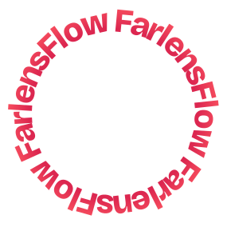

# FarlensFlow

  

Interest-based Farcaster funding. Search, match, and start your crypto flows.

## Introduction

FarlensFlow is a platform that bridges the gap between content creators on Farcaster and potential supporters. By leveraging the power of interest-based searches and automated crypto flows, FarlensFlow enables seamless, targeted funding for creators while allowing supporters to easily discover and fund content they're passionate about.

## Features

- **Interest-Based Search**: Utilize powerful search algorithms to find Farcaster creators aligned with your interests, supported by **Index Network** for efficient data indexing and querying.
- **Automated Crypto Flows**: Set up recurring or one-time crypto payments to support your favorite creators.
- **Creator Discovery**: Explore new content and creators based on your specified interests and criteria.
- **Customizable Funding Criteria**: Define specific parameters for automatic funding based on content type, engagement metrics, or other factors.
- **Integration with Farcaster**: Seamless connection with Farcaster accounts for both creators and supporters.
- **Analytics Dashboard**: Track your contributions and the impact of your support with **Ceramic** providing scalable data storage and management.

## Why FarlensFlow?

In the rapidly evolving world of decentralized social media, content creators often struggle to monetize their work effectively. Meanwhile, potential supporters find it challenging to discover and fund creators who align with their interests. FarlensFlow solves these problems by:

1. **Empowering Creators**: Providing a direct, interest-based funding mechanism that rewards quality content.
2. **Enabling Targeted Support**: Allowing supporters to easily find and fund creators in their niche interests.
3. **Streamlining Transactions**: Automating the funding process through crypto flows, reducing friction in the creator economy.
4. **Fostering Community**: Building stronger connections between creators and their audience through financial support and shared interests.

## How It Works

1. **Sign Up**: Create an account and connect your crypto wallet.
2. **Define Interests**: Specify your areas of interest or the type of content you want to support.
3. **Discover Creators**: Use our search functionality, powered by **Index Network**, to find Farcaster creators that match your criteria.
4. **Set Up Flows**: Configure automated crypto flows to support your chosen creators.
5. **Monitor and Adjust**: Track your contributions and adjust your flows as needed through our intuitive dashboard, utilizing **Ceramic** for robust data management.

## Use Cases

- **Niche Content Support**: Fund creators in specialized fields that align with your interests.
- **Community Building**: Support emerging creators and help grow communities around shared passions.
- **Patronage Model**: Establish long-term support for your favorite content creators.
- **Targeted Marketing**: For businesses, support creators who align with your brand values and reach your target audience.

## Technical Architecture

FarlensFlow's technical architecture leverages **Index Network** for decentralized indexing and querying, ensuring fast and reliable data retrieval. **Ceramic** is used for scalable data storage and management, enabling seamless interaction with dynamic data streams.

## Contributing

I welcome contributions from the community!

## Credits

FarlensFlow wouldn't be possible without the awesome open source ecosystem:

- [Index Network](https://index.network): Autonomous discovery experiences across the web
- [Ceramic Network](https://ceramic.network): For data storage and identity management
- [Radix UI & shadcn/ui ](https://www.radix-ui.com): Unstyled, accessible components for building high‑quality design systems
- [Tanstack Query](https://tanstack.com/query/latest): Powerful asynchronous state management for TS/JS
- [Lucide](https://lucide.dev): Beautiful & consistent icon toolkit
- [ConnectKit](https://docs.family.co/connectkit): Connecting users to web3 has never been easier
- [Wagmi](https://wagmi.sh): React Hooks for Ethereum
- [Viem](https://viem.sh): TypeScript Interface for Ethereum

## License

FarlensFlow is released under the [MIT License](LICENSE).
